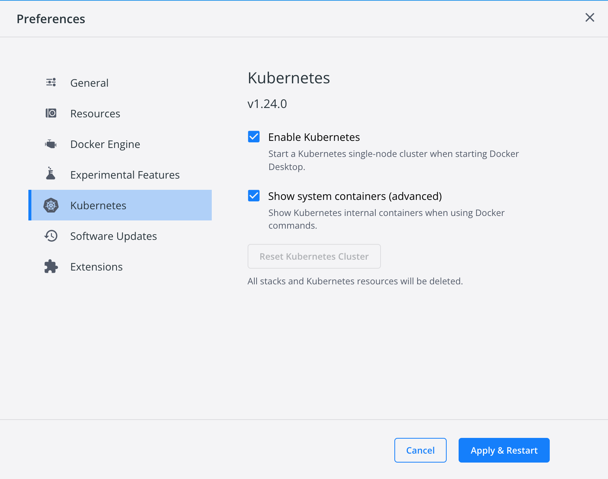

# K8S 
- [K8S](#k8s)
  - [1. Install some prerequisite tools](#1-install-some-prerequisite-tools)
  - [2. Init a cluster on local](#2-init-a-cluster-on-local)
    - [2.1. Docker Desktop](#21-docker-desktop)
    - [2.2. Minikube](#22-minikube)
    - [2.3. K3d](#23-k3d)
    - [2.4. Vagrant and Virtualbox](#24-vagrant-and-virtualbox)
  - [3. Check](#3-check)
  - [References](#references)

## 1. Install some prerequisite tools
- *This guide shows how to install docker, kubectl, helm, k9s, etc. on **MacOS**. <br> If you use other OS, please search on google.*
- **Install docker**: Follow [this link](https://docs.docker.com/desktop/mac/install/)

- **Install brew, kubectl and k9s**
  ```bash
  /bin/bash -c "$(curl -fsSL https://raw.githubusercontent.com/Homebrew/install/HEAD/install.sh)"
  brew install kubectl helm
  brew install derailed/k9s/k9s
  ```

## 2. Init a cluster on local
There are some options to init a cluster on local:
- Option 1: Using [**Docker Desktop**](#21-docker-desktop)
- Option 2: Using [**Minikube**](#22-minikube)
- Option 3: Using [**K3d**](#23-k3d) *(Recommended)*
- Option 4: Using [**Vagrant and Virtualbox**](#24-vagrant-and-virtualbox)

| Option 1 can only install a 1-node cluster, other options can install multiple-node clusters 

### 2.1. Docker Desktop
- Access Docker Desktop -> Settings -> Kubernetes -> Click `Enable Kubernetes` -> Apply & Restart
- 
- To uninstall, unclick `Enable Kubernetes` -> Apply & Restart

### 2.2. Minikube
- Install Minikube and start a cluster on local:
  ```bash
  brew install minikube

  # if you want to install 1 node (create a VM named `minikube` on )
  mini kube start       # 1 node, profile-name: minikube

  # if you want to install 2 nodes (create 2 docker containers, check: `docker ps|grep mininode`)
  minikube start --nodes 2 -p mininode # profile-name: mininode
  ```
- To delete
  ```bash
  minikube profile list
  minikube stop -p mininode
  minikube delete -p mininode
  # and delete 2 containers start with mininode if present
  ```

### 2.3. K3d
- Install K3d and start a cluster on local:
  ```bash
  brew install k3d
  
  # create a cluster with 1 control-plane and 2 workers
  k3d cluster create --agents 2

  # check
  k3d cluster list 
  ```
- To delete the cluster
  ```
  k3d cluster delete k3s-default
  ```

### 2.4. Vagrant and Virtualbox
- Install Vagrant and virtualbox
  ```
  brew install --cask virtualbox
  brew install --cask vagrant
  ```
- Create 3 VM (check config [here](./vagrant/))
    ```sh
    # Run this command 3 times
    # 1. At vagrant/master
    # 2. At vagrant/worker1
    # 3. At vagrant/worker2
    vagrant up
    ```

  - If you change vagrant config file or sh file or yaml file, cd to the dir contains the changed Vagrantfile and run 
    - `vagrant reload --provision` # if change sh or yaml file
    - `vagrant reload` # otherwise
    - consider use of `vagrant destroy` and `vagrant up`

  - If you want to delete vm, go to the directory and run `vagrant destroy`

- Init cluster
  - Init node in master (**No need to do anything** because it was inited when create master node) 
    - You can check vagrant/master/Vagrantfile and vagrant/init-master-cluster.
    - Ssh into master and run this command to get join command for workers
    ```sh
    kubeadm token create --print-join-command
    # copy the output command to clipboard
    ```

  - On each worker node:
    ```sh
    # paste join command to join
    kubeadm join ...
    ```
  - On master:
    ```sh
    kubectl get nodes
    kubectl get all --all-namespaces

    # label
    kubectl label node worker1 node-role.kubernetes.io/worker=worker
    kubectl label node worker2 node-role.kubernetes.io/worker=worker

    ```
- *Optional*: Re-Init the cluster by ssh (if it has errors or you want to reinit after change configs)
  - Ssh into each node and run `kubeadm reset` and choose y
  - With master: run commands in vagrant/init-cluster.sh
  - With workers: run join command to join cluster
  
- Notes

  ```text
  # IMPORTANT: Make sure that the CIDR in `calico-custom-resources.yaml` is same to `--pod-network-cidr` when init cluster

  Ranges of virtualbox: 192.168.56.0/21 (192.168.56.1 -> 192.168.63.254)

  I choose range inner cluster: 192.168.56.0/21

  -> choose 3 node out of 192.168.56.0/22 range
      master:   192.168.60.10 
      worker1:  192.168.60.11 
      worker2:  192.168.60.12
  ```
## 3. Check
 - Check:
  ```bash
  kubectl config get-contexts
  kubectl config use-context <context-name>  # example: docker-desktop|mininode|minikube|k3d-k3s-default|...
  kubectl get nodes
  kubectl cluster-info
  ```
## References
- [Viblo - K3D](https://viblo.asia/p/xay-dung-cum-kubernetes-high-availability-voi-k3s-va-k3d-4P856ppRZY3)
- [Viblo - Install-Minikube-Vargant-K8S - Viblo](https://viblo.asia/p/kubernetes-cac-khai-niem-co-ban-va-cach-khoi-tao-mot-kubernetes-cluster-Az45bD0NZxY)
- [Minikube - Multi-node](https://minikube.sigs.k8s.io/docs/tutorials/multi_node/)