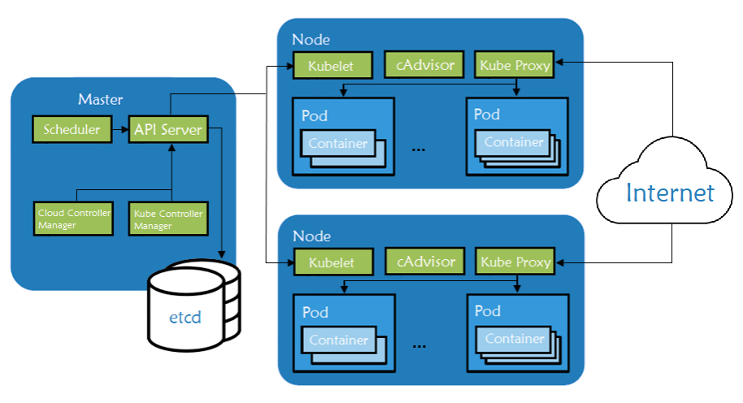
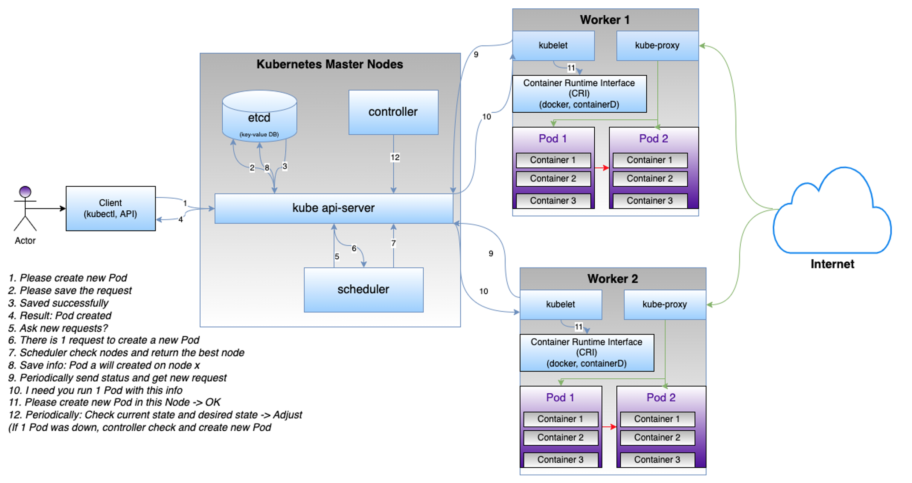
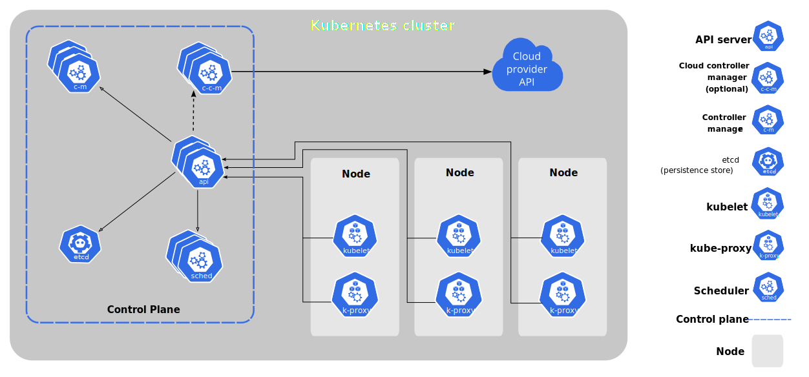
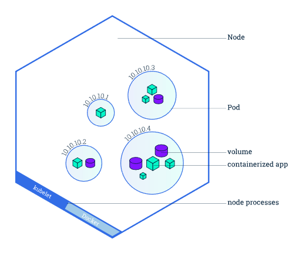
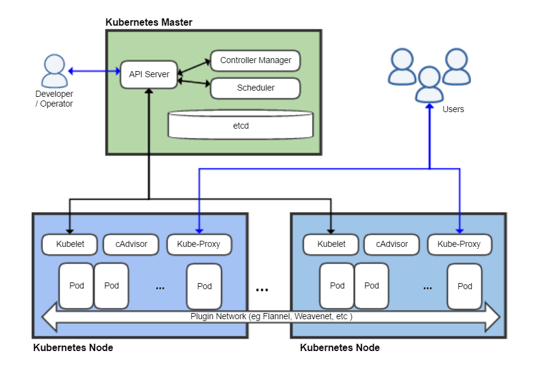

# K8S overview
- [K8S overview](#k8s-overview)
  - [Definition](#definition)
  - [Architecture](#architecture)
  

## Definition
**K8S** (kubernetes): An open source container orchestration platform, a system that automates the deployment, scaling, and management of containerized applications.

## Architecture
- Main architecture

    - 1 cluster = control-plane (master-nodes) + worker-nodes
    - 1 worker:
      - Pod: smallist unit in k8s, contains some containers, k8s will scale, delete pods, not each container
      - Proxy: control access from external
      - Kubelet: manager of each worker, manage its status and connect to the master
    - 1 master: 
      - api-server: provide apis
      - scheduler: periodically check tasks and do tasks
      - controller-manager: periodically check status of workers and adjust them to expected status
      - etcd: key-value Database to save info of the cluster

- Simple flow to create a new pod
  
  - kubectl: client cli tool to control cluster through api-server

    
Others Images

    
Architecture from homepage

    
    
Node and Pod

    
    
Architecture from somewhere

    

